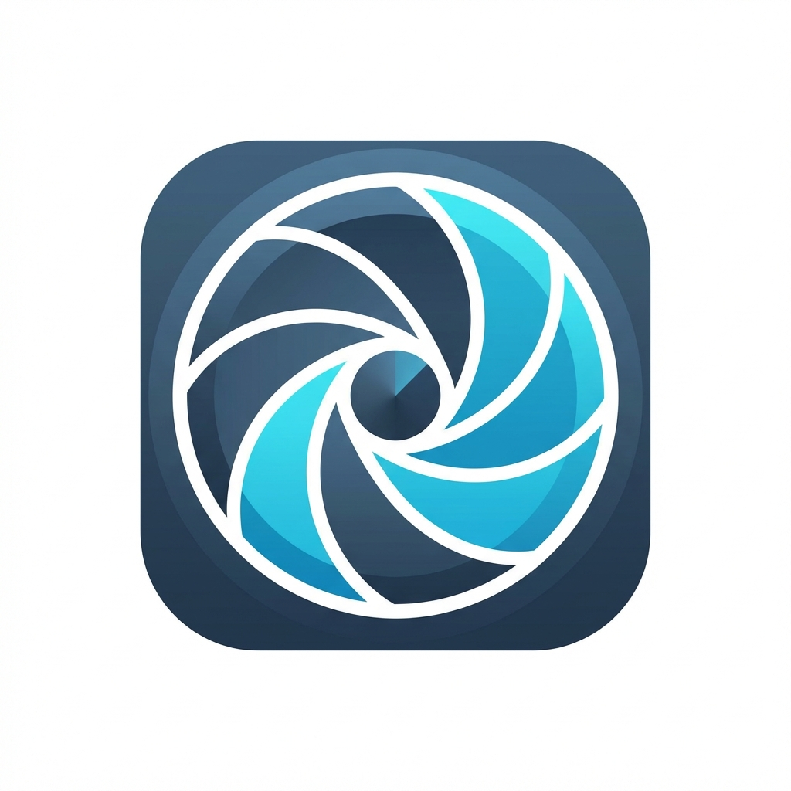

# FocusLens AI 💎

FocusLens AI is a privacy-first, gamified Chrome Extension designed to help you regain control of your time and stay focused on your goals. It transforms time management into a game where your focus is your currency.

---

## Preview

---

## Key Features

- **Privacy-First Architecture**: No servers, no tracking. All usage data and history stay locally on your device in your browser's storage.
- **Goal-Oriented AI**: Select goals like *Coding*, *Study*, *Fitness*, or *Content Creation*. The AI adapts its classification based on your current focus.
- **Dynamic Credit Economy**:
  - **Daily Allowance**: Start every day with **30 💎 Credits**.
  - **Earn while you Work**: Productive sites (GitHub, LeetCode, Wikipedia, etc.) earn you **1 credit every 5 minutes** (0.2/min).
  - **Pay for Distractions**: Social media and entertainment sites cost **1 credit per minute** (1.0/min).
- **Interactive Interventions**:
  - **Soft Lock (AI Eye)**: When you visit a distraction, a blurred overlay appears featuring a glowing, animated **AI Eye** and a 5-second reflection timer.
  - **Hard Lock (Bankrupt)**: If your credits hit 0, distracting sites are completely blocked until you earn more by being productive.
- **AI Insights & Focus Score**: Real-time analysis of your "Fragmented Focus" (tab switching habits) and a daily Focus Score out of 100.
- **Snarky Personality**: Context-aware "Snarky Toasts" that comment on your behavior (e.g., "Spending mode active 💸...").

---

## Tech Stack

- **Frontend**: Vanilla JavaScript (ES6+), HTML5, CSS3 (Modern Glassmorphism & Keyframe Animations).
- **Core Extension Logic**:
  - **Background Service Worker**: Handles global state, alarm-based time tracking, and economy calculations.
  - **Content Scripts**: Injects the AI Interface and handles real-time page blurs.
  - **Communication**: Chrome Runtime & Tabs Messaging for cross-script synchronization.
- **Data Persistence**: Chrome Storage API (Local) using a key-prefix strategy for performance.
- **APIs Used**: Chrome Alarms (for precise tracking), Chrome Scripting, and Chrome Tabs.

---

## Installation (Manual)

1. **Clone/Download**: Download this repository as a ZIP and extract it.
2. **Extensions Page**: Open Google Chrome and go to `chrome://extensions`.
3. **Developer Mode**: Toggle the **Developer mode** switch in the top-right corner.
4. **Load Extension**: Click **Load unpacked** and select the root folder of this project.

---

## How to Use

1. **Set a Goal**: Click the FocusLens icon in your toolbar and select your category (e.g., *Coding*).
2. **Productive Domains**: 
   - **Coding**: GitHub, StackOverflow, LeetCode, CodeChef, ChatGPT, local development, etc.
   - **Study**: Coursera, Wikipedia, Notion, LinkedIn, etc.
3. **Smart Reference Mode**: YouTube is dynamically classified—it's **Productive** for Study/Coding goals (tutorials) but **Distracting** for others.
4. **Monitor Progress**: Open the popup to see your **Daily Focus Score**, **Credit Balance**, and your **Top 5 most visited sites**.

